# RAVIJA VITHARANA
### Software Engineer

*I build software and turn complicated systems into things you can see.*

 

## MY CODE, VISUALIZED.

<!-- SUNBURST:START -->

 **TypeScript** ·  **CSS** ·  **Dockerfile** ·  **JavaScript** ·  **HTML** ·  **Python** ·  **Java** ·  **QML** ·  **Shell** ·  **other**
<!-- SUNBURST:END -->

*Languages → Projects → Codebase*
 
Automatically generated from my public repositories. Click the disk to explore interactively.

 

---

### /focus

**Backend systems · Concurrency · Databases · AI / Computer Vision**

---

### /featured

**LumiSign**
*Indian Sign Language → English recognition focused on robust low-light performance.*

`FastAPI` · `React` · `Transformer` · `MediaPipe`

> **Engineering:** Real-time video processing and model inference pipeline designed for edge performance.

[View project →](https://github.com/ravijaanthony/LumiSign)

---

### /projects

**STSBookingSystem**
*Segment-based train seat booking system for Sri Lanka with concurrent reservation handling.*
`Python` · `TypeScript` · `PostgreSQL` (GiST constraints, `SELECT FOR UPDATE`) · `FastAPI` · `Docker`
[Repository →](https://github.com/ravijaanthony/STSBookingSystem)

**KaprukaAgentChallenge2026**
*AI-driven application development and multi-agent orchestration.*
`TypeScript` · `AI Agents`
[Repository →](https://github.com/ravijaanthony/KaprukaAgentChallenge2026)

**MedWikiAgentic**
*Agentic workflows for medical knowledge retrieval and synthesis.*
`Python` · `LangChain`
[Repository →](https://github.com/ravijaanthony/MedWikiAgentic)

**cv_pipeline**
*Modular computer vision pipeline for image processing and analysis.*
`Python` · `OpenCV`
[Repository →](https://github.com/ravijaanthony/cv_pipeline)

---

### /stack

**Primary**
`Java` · `Python` · `TypeScript`

**Also used**
`JavaScript` · `HTML/CSS` · `Docker` · `PostgreSQL` · `QML` · `Shell`

---

### /current

Currently focused on **Java**, concurrency, backend systems, and software architecture.
[See Java_Concurrency →](https://github.com/ravijaanthony/Java_Concurrency)

---

☕ *Espresso enthusiast.*

 

**[LinkedIn](https://linkedin.com/in/ravijaanthony)** · **[GitHub](https://github.com/ravijaanthony)** 
 
[Instagram](https://instagram.com/ravijaanthony) · [X](https://twitter.com/ravija_anthony)

---

**This README is generated by code.**
 
A GitHub Actions workflow analyzes my repositories, maps languages to projects, and renders the codebase as the disk above.

